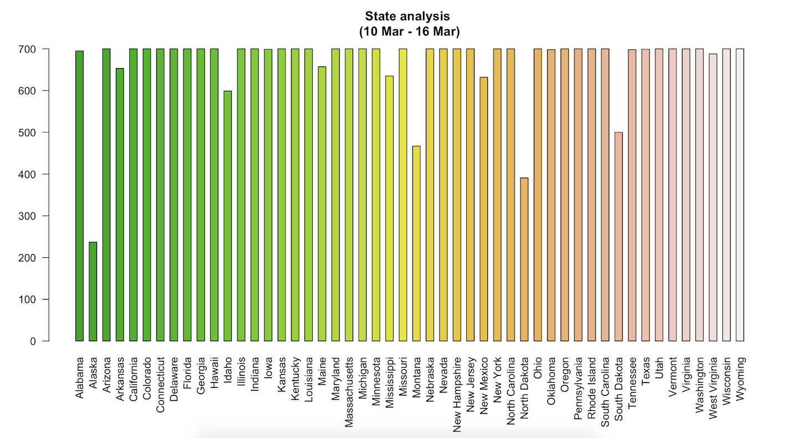

# National-Emerg

This project will discuss the public reaction to a national disaster like recent spread of COVID-19 in the world and the US by observing the users tweets in twitter including #COVID-19. Gathering information about the number of tweets in different states, the frequency of tweets and the popularity of tweets will provide us with information we can use to analyze the social reaction to global warming.
The data needed for this project where gathered from the available API from Twitter using Python and JSON (Python codes are availabe here). The tweets are collected from a 100 mi circular area of the state capitals across the US. The following map shows the tweets area for the current study.

This data contains the coordinates of all the state capitals within the range of 100 mi in a circular area following with user id, date, text, favorite tweets numberand state, you can see as follows:

The Provided plots shows the followings:

1. The correlation between the number of tweets during the last 7 days in different states. 
2. The frequency of tweets during different days of the week. The focus was on the last 7 days since the situation was changing drastically in the nation. 
3. The change in the number of tweets per day in the states with least number of tweets in general. (The effects of declaring this pandemic as a national emergency by the president on the social reaction to this phenomenon in different states)

In the following plots, we chose the states with the fewer number of tweets. We can see how declaring national emergency over the spread of virus impacted the social concers. 

