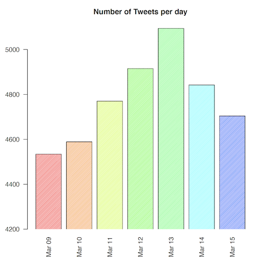
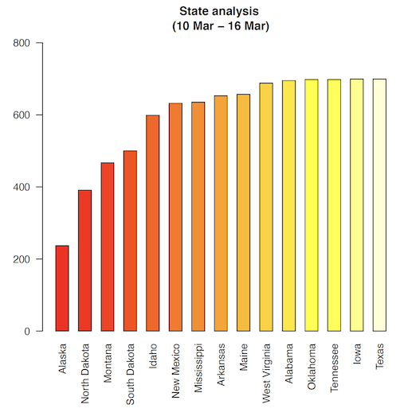
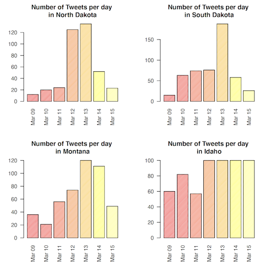

# National-Emerg

This project will discuss the public reaction to a national disaster like recent spread of COVID-19 in the world and the US by observing the users tweets in twitter including #COVID-19. Gathering information about the number of tweets in different states, the frequency of tweets and the popularity of tweets will provide us with information we can use to analyze the social reaction to global warming.

The data needed for this project where gathered from the available API from Twitter using Python. The tweets are collected from a 100 mi circular area of the state capitals across the US. The following map shows the tweets area for the current study.

This data contains the coordinates of all the state capitals within the range of 100 miles in a circular area following with:
- user id
- date 
- text 
- favorite count 
- retweets numbers
- state

The follwing shows examples of the collected data:

user_id | date | text | favorite_count | retweet_num | state
--- | --- | --- | --- | --- | ---
aliner |	Mon Mar 09 23:57:29 +0000 2020	| An infectious disease doctor answers your COVID-19 and coronavirus questions | 3 | 0 |	Alabama
BFD1982USN |	Mon Mar 09 23:43:21 +0000 2020	| Seeking trial delay, sheriff makes false COVID-19 claim (from @AP)	| 2 | 1	| Alabama	
MGMAdvertiser	| Mon Mar 09 23:31:03 +0000 2020 | No cases of coronavirus COVID-19 have been diagnosed as of March 9, but health officials want Alabamians to be awar… | 1 | 1 | Alabama
marionstevens | Mon Mar 09 23:22:39 +0000 2020 | The flu vaccine csn protect you from COVID-19. How? The vaccine reduces your chance of getting the flu, which reduc… | 0 | 0 | Alabama
beep___boop | Mon Mar 09 23:21:14 +0000 2020 | Pozzing my neg friends with COVID-19 | 4 | 0 | Alabama
abc3340 | Mon Mar 09 23:01:55 +0000 2020 | Etowah County Jail staff are working to stop the spread of COVID-19 if it shows up in the county jail | 2 | 0 | Alabama

The Provided plots shows the followings:

1. The correlation between the number of tweets during the last 7 days in different states. 
2. The frequency of tweets during different days of the week. The focus was on the last 7 days since the situation was changing drastically in the nation. 
3. The change in the number of tweets per day in the states with least number of tweets in general. (The effects of declaring this pandemic as a national emergency by the president on the social reaction to this phenomenon in different states)

In the following plots, we chose the states with the fewer number of tweets. We can see how declaring national emergency over the spread of virus impacted the social concers. 

